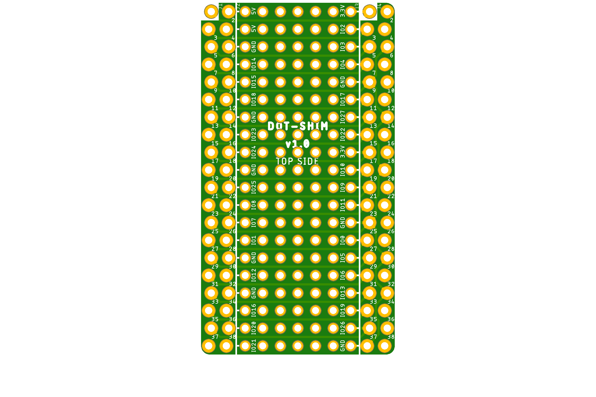
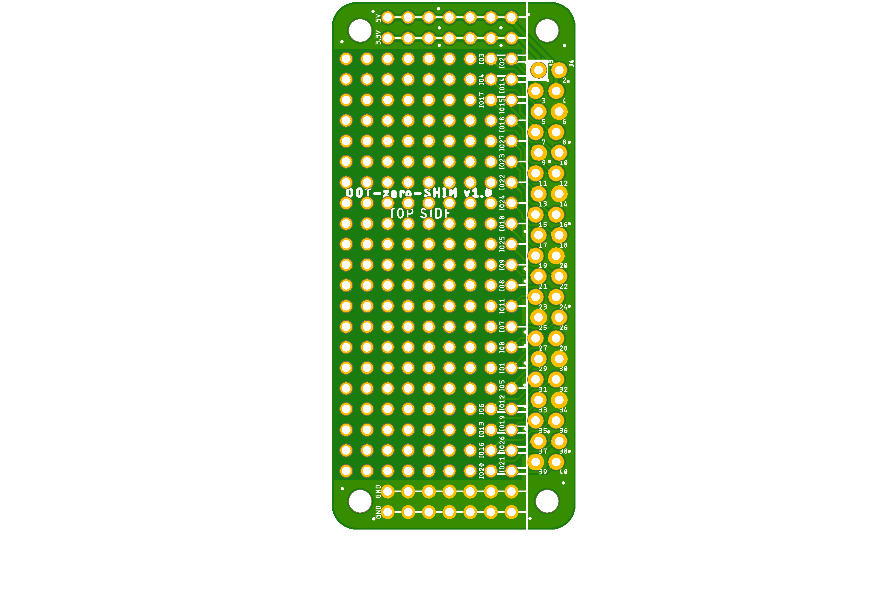
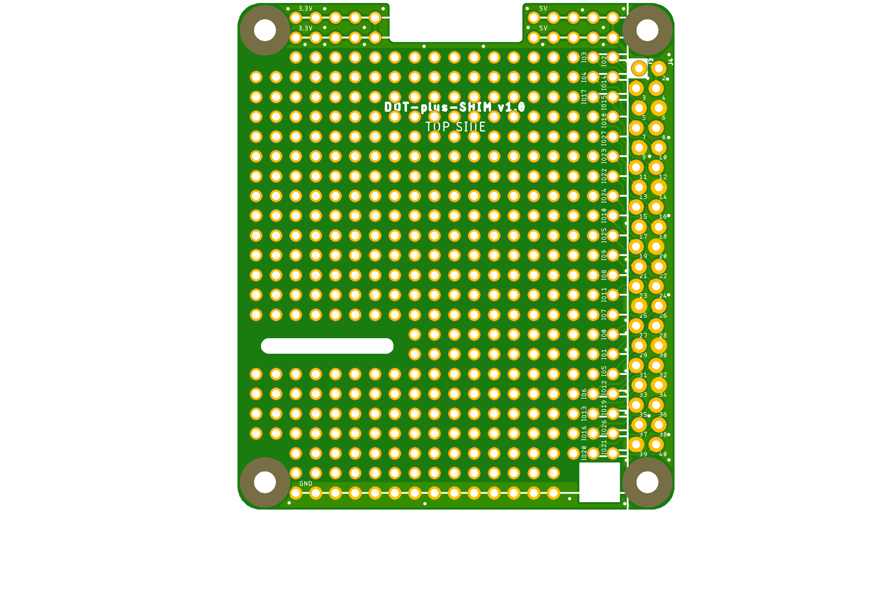

# DOT-SHIM project

DOT-SHIM (mini-HAT), a DIY 2.54mm raster board for Raspberry Pi.

Some time ago I have tried to attach something self-made schematics to a zero Pi with some limited success.
Here I've designed a 2.54mm raster board for DIY applications.

Some useful links:

- [pinout.xyz](https://pinout.xyz/) - a brilliant resource on topic of Pi's pinout and HATs.
- [raspberrypi/hats](https://github.com/raspberrypi/hats) - Pi's HAT specification.

## DOT-SHIM

Raspberry Pi 40-pin **DOT-SHIM** mini-HAT.

Preview:

[Schematics in PDF format](DOT-SHIM.pdf)

Features:

- locked Pi headers
- 2.54mm raster holes
- clear pin description
- double set of Pi headers (for inside and outside mount)
- can be used as SHIM (no headers) or HAT (with headers) 

CAM files are available.

## DOT-zero-SHIM

Raspberry Pi zero 40-pin **DOT-zero-SHIM** mini-HAT.

Preview:

[Schematics in PDF format](DOT-zero-SHIM.pdf)

Features:

- locked Pi headers
- 2.54mm raster holes
- clear pin description
- Pi zero board style
- can be used as SHIM (no headers) or HAT (with headers)

CAM files are available.

## DOT-plus-SHIM

Raspberry Pi A+/B+ 40-pin **DOT-plus-SHIM** mini-HAT.

Preview:

[Schematics in PDF format](DOT-plus-SHIM.pdf)

Features:

- locked Pi headers
- 2.54mm raster holes
- clear pin description
- Pi A+/B+ board style
- can be used as SHIM (no headers) or HAT (with headers)

CAM files are available.

## How to help

Your contributions as code, resources or finances are welcome!
Please contact me directly over e-mail andriy.golovnya@gmail.com or over [GitHub profile](https://github.com/red-scorp).
Link for [Paypal donations](http://paypal.me/redscorp), which are always welcome.
Thanks in advance!
